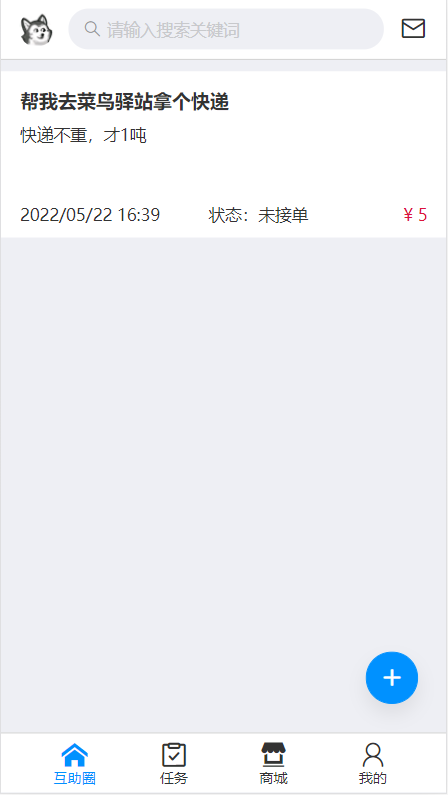
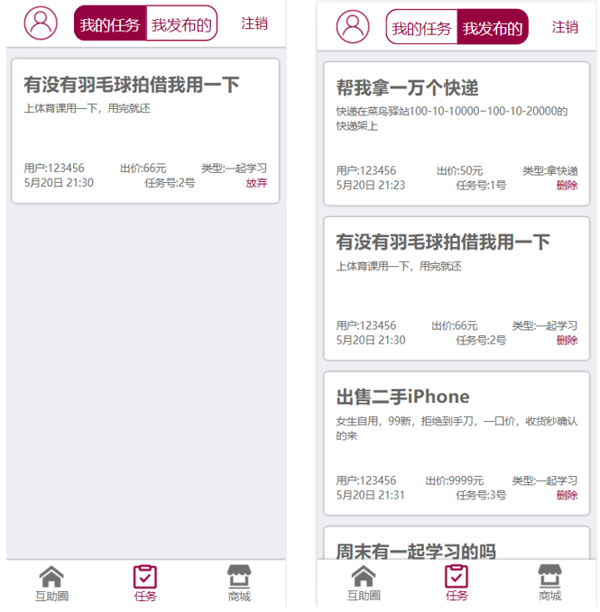
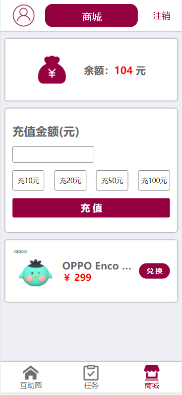

# 互助圈（校园互助平台）

## 说明

本项目源自于之前用jQuery写的校园互助平台，这次用Vue重构了一遍。后端用的Egg写的屎山接口，还没有来得及重构。后台管理暂时也还没有写。

**[jQuery版](https://demo.lbviic.com/%E9%9D%99%E6%80%81%E9%A1%B5%E9%9D%A2/%E4%BA%92%E5%8A%A9%E5%9C%88)**：手动在localStorage添加一个token即可绕过登录

## 介绍

本项目为手机网页，实现了用户的登录注册，发布接受任务，悬赏任务，充值余额，使用余额兑换商品功能。

## 界面

## 组件

- HelpMe
  - HelpMe.vue——帮帮我
  - HelpMeMenu.vue——发布任务表单
- Store
  - Good.vue——单个商品
  - Store.vue——商城
- Tab
  - FooterTab.vue——底栏
  - HeaderTab.vue——顶栏
- Task
  - Task.vue——任务列表
  - TaskList.vue——单个任务
- Home.vue——主页面
- IHelp.vue——我来帮
- Login.vue——登录
- Register.vue——注册

